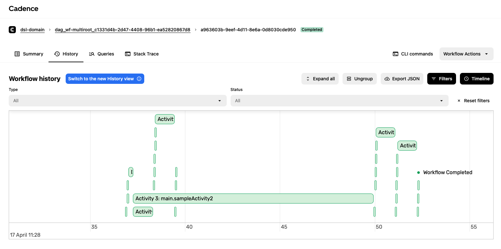

# DAGWorkflow

DAGWorkflow is a flexible, graph-based workflow engine designed for high-concurrency orchestration. It is built as a companion implementation for **US11307967B2 - Test orchestration platform**. Originally created 7 years ago as a personal Proof of Concept (PoC), it has been modernized and updated for demonstration of state-of-the-art workflow patterns.

The engine leverages **Uber Cadence** (now Temporal-compatible) for persistence and reliability, and uses a DAG (Directed Acyclic Graph) structure inspired by the Hashicorp Terraform library to manage complex task dependencies.

> [!NOTE]
> **Historical Context:** This repository was formulated circa ~2019 (approx. 7 years ago) prior to the explosive growth of the Temporal ecosystem. Today, you can find modern equivalents and native implementations of DSLs and DAG runners provided directly in the [official Temporal Go SDK samples](https://github.com/temporalio/samples-go/tree/main/dsl), as well as open-source frameworks like [iWF (interface Workflow)](https://github.com/indeedeng/iwf) which aim to provide higher-level declarative workflow abstractions natively on top of Cadence/Temporal. This repository stands as an early architectural demonstration of these concepts.




## Key Features
- **Deterministic Graph Execution**: Execute complex branching and parallel logic with reliable state recovery.
- **Dynamic Reloading**: Signal a running workflow to reload its DAG definition on-the-fly.
- **Generic Activity Framework**: Easily bind Go activities to YAML-defined workflow steps.
- **Result Extraction**: Map internal workflow variables to a final non-null output payload.

### Uniqueness vs. Modern DSLs (iWF, Serverless Workflow)
While modern frameworks like the Serverless Workflow specification or Temporal's iWF provide excellent declarative abstractions, this DAG implementation tackles highly dynamic edge cases that are typically rigid in other YAML engines:
* **Runtime DAG Mutation via `next_key`**: Activities can generate lists of next node *names* on the fly. The DAG topology actively recalculates and resolves transitive dependencies mid-flight rather than being statically compiled.
* **Templated Prototypes (`proto: true`)**: Nodes can be marked as prototypes, serving as factories for loops. The engine automatically scopes variables (`$$node_id`, `$$iterator`) giving you programmatic recursion natively within the YAML graph.
* **Dynamic Scoping**: State context is isolated through explicitly defined boundary namespaces (`test.flipcoin2`), preventing variable collisions in complex parallel branching.

---

## 🛠 Setup & Integration Testing

To run the full E2E environment, you need a Cadence server and a Go worker.

### 1. Start Cadence Stack
The easiest way to start the backend (Cadence + Cassandra + Web UI) is via Docker Compose:

```bash
git clone https://github.com/cadence-workflow/cadence.git
cd cadence/docker
docker-compose up -d
```

### 2. Build the DSL Worker
Requires Go 1.22+.

```bash
cd src/dsl
go mod tidy
go build -o dsl ./
```

### 3. Run the Worker
The worker registers the activities and listens for workflow tasks.

```bash
./dsl -m worker -config config/development.yaml
```

### 4. Trigger a Workflow
In a separate terminal, submit a DAG configuration to the engine:

```bash
./dsl -m trigger -dslConfig samples/workflow_result.yaml
```

---

## 🧪 Scenarios

| Workflow | Description |
|---|---|
| `workflow_dag.yaml` | Standard sequence/parallel execution with coin-flip logic. |
| `workflow_job.yaml` | Generic monitoring and retry flow for external jobs. |
| `workflow_result.yaml` | **(New)** Demonstration of non-null result extraction. |
| `workflow_dag_sleep.yaml` | Handling timers and delays within the graph. |

*Note: Legacy `SimpleDSLWorkflow` components have been moved to the `src/dsl/archive` directory.*

---

## 📜 Acknowledgments
Developed as a personal demonstration of distributed orchestration patterns and as a companion to the architectural concepts in US Patent 11,307,967.
